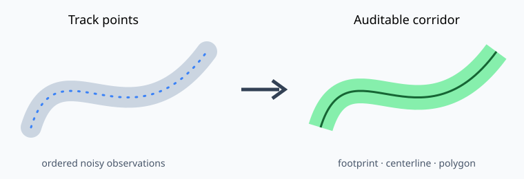

# track2corridor-geo

**Build an auditable centerline and corridor from noisy survey-track points.**



`track2corridor` turns ordered points into a buffered footprint, raster skeleton,
NetworkX graph, centerline, and fixed-width corridor. It writes every intermediate
geometry and a JSON diagnostics report instead of hiding algorithm warnings.

## Install

```bash
python -m pip install track2corridor-geo
```

## Use

```bash
track2corridor build track.laz \
  --footprint-width 20 \
  --corridor-width 8 \
  --output corridor.gpkg
```

CSV input must contain `x,y` columns and needs an explicit projected CRS:

```bash
track2corridor build track.csv --crs EPSG:32637 --output corridor.gpkg
```

The GeoPackage contains `footprint`, `centerline`, and `corridor` layers. The
adjacent JSON records raster size, graph size, connected components, pruning, and
endpoint extension. Coordinates are never reprojected automatically.

## Python API

```python
from track2corridor import CorridorOptions, build_corridor

result = build_corridor(points, "EPSG:32637", CorridorOptions(corridor_width=6))
print(result.diagnostics.to_dict())
```

Copyright 2026 Alena Nikitina. Licensed under the Apache License 2.0.

